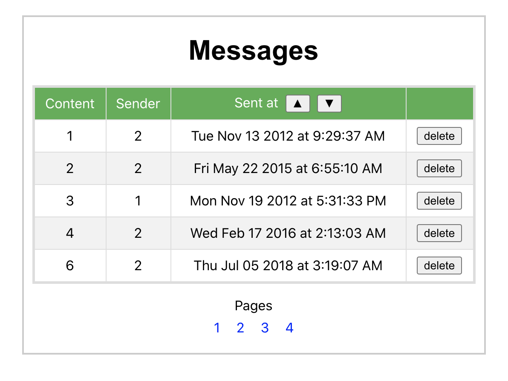

# Displaying messages
This application is built with React. It receives as input a list of messages. The messages are deduplicated and displayed 5 messages per page, with easy navigation to individual pages. The messages can be sorted in ascending and descending order by the date and time they were sent. It is also possible to delete messages one by one.

Here is a screenshot:

  

## Viewing the app
In the project directory run:
### `npm start`
and open [http://localhost:3000](http://localhost:3000) to view it in the browser.
